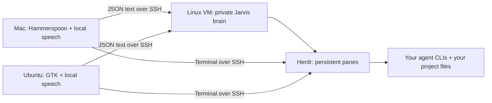

# Headless agents + Jarvis: a friend's setup kit

Keep your agent chats running on a Linux VM. Use a Mac or Ubuntu desktop as the keyboard, microphone and screen. Close the laptop and the VM keeps working. Reconnect to the same panes later.

This is a clean starter distilled from a working personal setup, dated 30 September 2026. It includes its own small VM brain and desktop shells rather than private account wrappers. This public starter uses your own accounts and configuration. Desktop acceptance remains required.



Audio stays on the desktop; transcribed commands and text you explicitly paste go to the VM. Agent providers may receive prompts under your own account settings. This kit makes no promise about their data handling. It includes no accounts, keys, chat histories, customer files or VM addresses.

## What you need

An Ubuntu VM with SSH, Python 3.10+, systemd user services, and storage for your projects. Install Herdr on the VM and desktop at matching compatible versions; development syntax was checked against installed Herdr 0.9.3. Use a private network/VPN or normal SSH access you control. You enter all login/trust prompts yourself.

For Mac: Hammerspoon, Python 3.10+, and a terminal. For Ubuntu desktop: Python venv support, GTK 3 Python bindings, and a terminal that handles Herdr's clipboard output. Optional voice adds local Whisper and microphone dependencies, a first-run model download and OS microphone permission.

Primary references: [Herdr installation](https://herdr.dev/docs/install/), [Herdr persistence](https://herdr.dev/docs/persistence-remote/), [Hammerspoon](https://www.hammerspoon.org/). Check the installed `herdr --help` if your version differs.

## Thirty-minute terminal-first setup

The estimate assumes the VM, SSH and agent CLIs already exist. Downloads, OS installation and account onboarding can take longer.

1. **0–5 min:** Make your own SSH alias using `config/ssh.example`. Verify the VM host-key fingerprint through a trusted channel before accepting it. Test `ssh YOUR_VM_SSH_ALIAS`. This kit does not write SSH files or generate keys.
2. **5–10 min:** Put this folder on the VM using your own transfer method. From it run `bash install.sh vm`. Review `~/.config/headless-kit/kit.json`. The default `share-kit` session is isolated from your other Herdr sessions; the installer records your Herdr executable path. Start it explicitly:
   ```bash
   systemctl --user daemon-reload
   systemctl --user enable --now headless-kit-herdr headless-kit-brain
   python3 ~/.local/share/headless-kit/bin/doctor.py vm
   ```
   To keep user services alive after SSH logout, the VM owner enables lingering for this user (`loginctl enable-linger "$USER"`); this may require administrator authorization. Verify with `loginctl show-user "$USER" -p Linger`.
3. **10–15 min:** Attach from the desktop:
   ```bash
   herdr --remote YOUR_VM_SSH_ALIAS --session share-kit --remote-keybindings server
   ```
   Create panes in Herdr and give them unique labels such as `Research` and `Build`. Start your own installed agent CLI in each pane; handle authentication yourself. Close/reopen the terminal and check that the same panes and agents remain.
4. **15–25 min:** From this kit on the desktop run `bash install.sh mac` or `bash install.sh ubuntu`. Edit the desktop `~/.config/headless-kit/kit.json`, replacing `YOUR_VM_SSH_ALIAS` with your own alias. For Mac, add to your existing Hammerspoon `init.lua`:
   ```lua
   shareKitJarvis = dofile(os.getenv('HOME') .. '/.local/share/headless-kit/mac/jarvis.lua')
   ```
   Reload Hammerspoon yourself. Grant Accessibility and later Microphone permission when requested. Ctrl+Alt+J opens commands; Ctrl+Alt+P opens the paste box; Ctrl+Alt+Space listens; Ctrl+Alt+Escape hides the orb. Mac terminal activation uses the `terminal` setting.
   For Ubuntu, install OS prerequisites yourself if missing (`python3-venv`, `python3-gi`, `gir1.2-gtk-3.0`, `libportaudio2`). Run the installer commands it prints from your desktop session. Set a GNOME custom shortcut to `bash ~/.local/share/headless-kit/bin/ui-command.sh show`; add `listen` and `dictate` shortcuts if desired. GTK runs with your desktop session. GNOME Wayland may restrict window positioning; the starter uses a normal window rather than claiming unrestricted overlays.
5. **25–30 min:** Type `status`, `go to Research`, `focus Research`, then `unfocus`. Try the paste box with harmless text in an idle agent pane; verify it has **not** been submitted. Press Enter yourself only when ready. Check status banners and register one synthetic session before testing park/restore.

## Voice (optional after the terminal checks)

Re-run the desktop installer with `--speech`, e.g. `bash install.sh mac --speech`. Dependencies are downloaded into this kit's private venv. The first microphone request downloads the `base.en` Whisper model to its standard user cache, then transcribes locally. The installer does not pre-download models. The dependency ranges are supplied for portability; a fresh dependency installation and real microphones have not been verified in this packaging run.

Ubuntu supports local dictation: press Dictate, speak, then Listen/Stop. Review the result in the paste box. Mac uses local push-to-talk and accepts typed/pasted longer text. The listener implementation also has a wake-word mode, but the starter shells run with wake **off**; `wake_word` is reserved for a later integration and changing it alone does not enable wake. Wake-word dependencies/models and always-on mic UI are intentionally outside this starter. Avoid two assistants listening to the same microphone in a nested VM.

## Park, restore and focus layout

On the VM, register each agent's own session ID before parking (find it inside that CLI; never borrow another person's saved ID):

```bash
python3 ~/.local/share/headless-kit/bin/sessions.py register Research claude YOUR_SESSION_ID ~/projects/research
python3 ~/.local/share/headless-kit/bin/sessions.py park Research
python3 ~/.local/share/headless-kit/bin/sessions.py restore Research
python3 ~/.local/share/headless-kit/bin/focus-layout.py Research Build
```

Use `codex` in the registration command for a Codex session. Register the correct project folder. Registration saves only kind, ID and folder in your own private local state. Parking accepts only an idle/done agent with a registered matching kind; it sends two Ctrl+C keys and checks that the agent exited. Restore accepts only a verified foreground shell and resumes the registered ID. It never guesses an ID or copies history. Review a shell with a partially typed command before restore; the kit cannot detect all terminal input state. Login and trust prompts remain yours. There is no automatic bulk park or resume on boot.

`focus LABEL` zooms one pane; `unfocus` restores the split view. The explicit focus-layout helper arranges two or three exact labels into a row; it moves panes and reads their changed IDs back. It may leave an empty temporary tab, removable manually. Automatic multi-project column balancing is outside this starter.

## Verification and limits

Run `python3 -m unittest discover -s tests -v` in the source folder. Tests use fake agents and a temporary socket; they do not send work to real chats. See `VALIDATION.md` for what was checked. On each real desktop complete: SSH reconnect, pane persistence, command focus, paste without Enter, local microphone, hide/show orb, status banner and a synthetic park/restore. A test pass does not establish real desktop acceptance.

Notifications are on-demand status banners. Continuous agent-completion subscriptions, automatic discovery of pages made by agents, broad natural-language dispatch, voice choice pills, automatic parked-chat discovery, screenshots and project-specific routing are not in this starter. Use exact pane labels. The small brain supports the commands listed above and makes no external model calls.

## Files for your Space

Paste the five short files in `pages/` as separate Pages. `ONE-PAGE.md` is the overview. Put the supplied single ZIP in your Drive when you decide to share it. This release has fresh public history. Use the public GitHub repository as a template or download the source. Never add your private configuration or recordings to a public fork.

## Stop or remove the kit

Disable its dedicated VM units: `systemctl --user disable --now headless-kit-brain headless-kit-herdr`. On Ubuntu disable `headless-kit-shell`. Remove the single Hammerspoon dofile line and reload; call `shareKitJarvis.stop()` before reloading if needed. Delete only the kit's installed folder, configuration and dedicated unit files after reviewing any registered sessions. Your agent histories and project files remain in their original account locations. Do not delete those to uninstall this kit.
