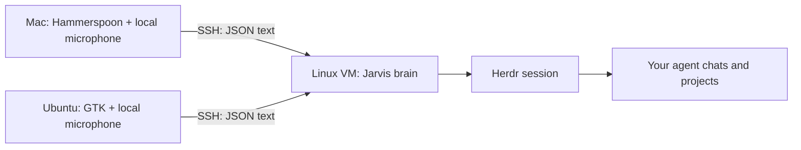

# Architecture: the VM brain and the thin shells

The VM runs Herdr plus a private Unix-socket brain. It stays available while your laptop windows come and go. Each desktop shell asks the brain to focus an exact pane label, show statuses, park or restore a registered session, or paste reviewed text.

The desktop transcribes speech locally. Audio stays there; recognized command text goes through SSH. Agent prompts may then go to the providers you use under your own account settings.

Use one dedicated Herdr session for this kit. Do not expose the brain socket as a public network service. Keep your own SSH host-key checks enabled and log in with your own account. Terminal attachment is separate from the Jarvis request channel, so you can keep working if the little voice window is unavailable.
